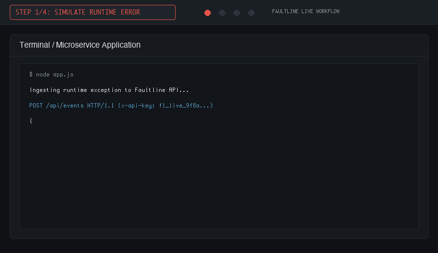
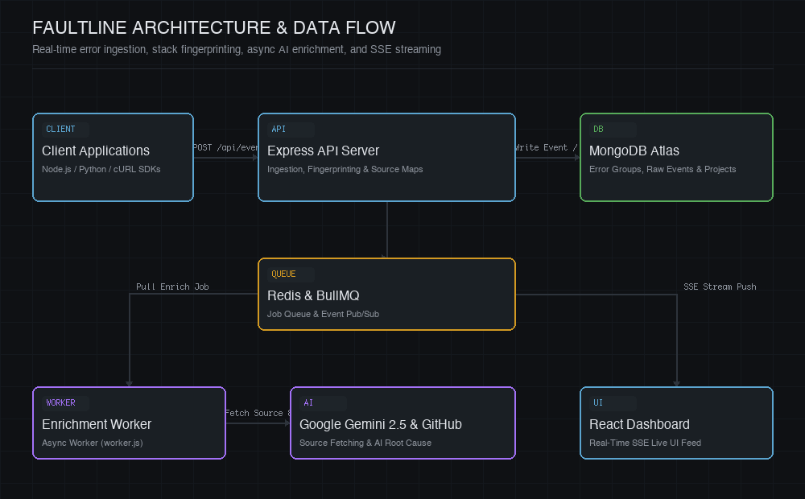
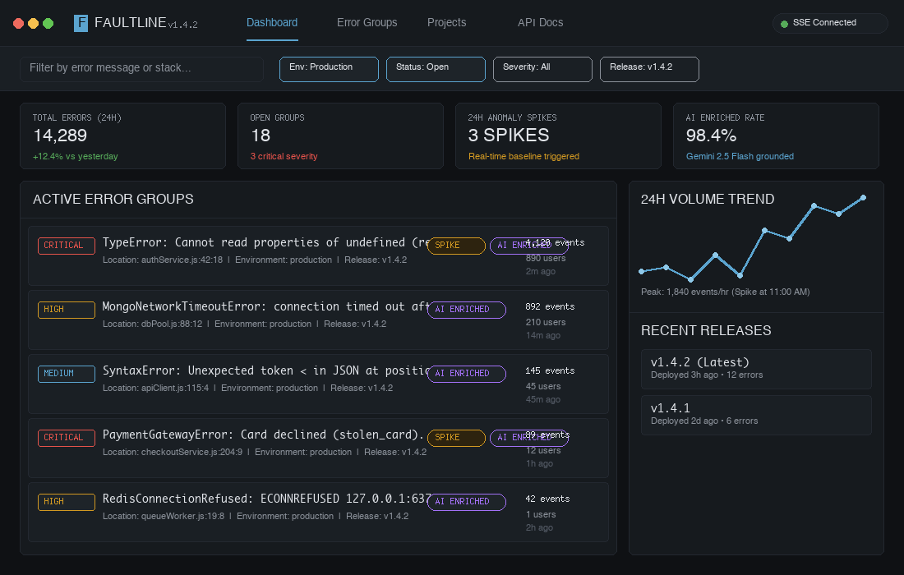
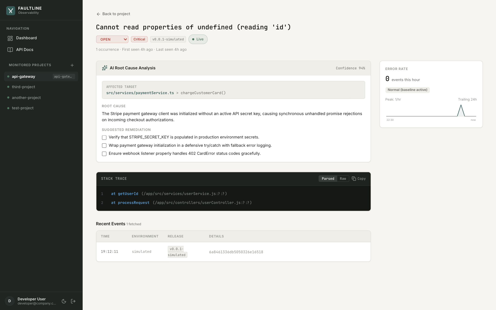
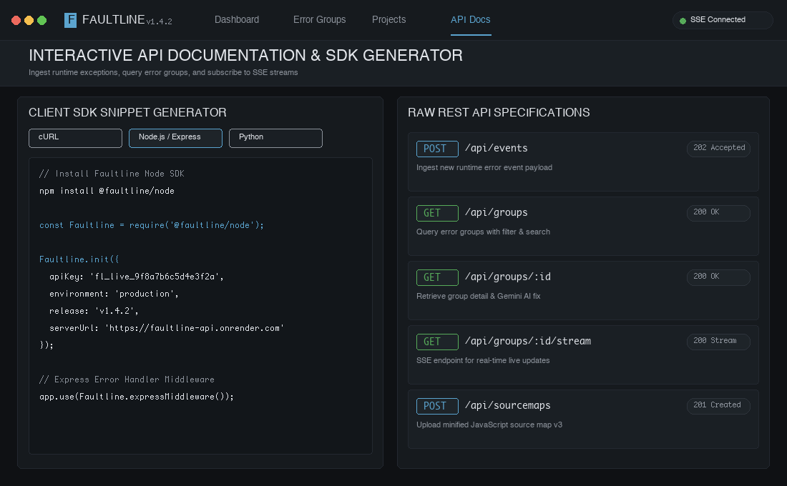

# Faultline: AI-Grounded Error Intelligence Platform

[](#verification-and-test-suite)
[](#tech-stack)
[](#license-and-documentation)

> Faultline is a real-time error tracking and AI-grounded root-cause intelligence platform. It provides automated deduplication, source-map resolution, baseline anomaly detection, and asynchronous AI enrichment powered by Google Gemini 2.5 Flash.

---

## Live Workflow Demonstration



*Figure 1: End-to-end event execution path — Error Simulation -> Stack Fingerprinting & Grouping -> Async AI Enrichment -> Live SSE Dashboard Push.*

---

## Deployed Environments

| Service | Endpoint / URL | Status |
| :--- | :--- | :--- |
| **Web Dashboard UI** | [https://faultline-dashboard.vercel.app](https://faultline-dashboard.vercel.app) | Production |
| **Express API Service** | [https://faultline-api.onrender.com](https://faultline-api.onrender.com) | Production |
| **Live API Documentation** | [https://faultline-api.onrender.com/docs](https://faultline-api.onrender.com/docs) | Active |
| **Health Check** | [https://faultline-api.onrender.com/health](https://faultline-api.onrender.com/health) | Active |

---

## Key Features

- **AI Root-Cause Intelligence**: Asynchronous background enrichment using Google Gemini 2.5 Flash, grounded with GitHub code repository context.
- **Real-Time SSE Dashboard**: Server-Sent Events (SSE) stream live error occurrences, count updates, and enrichment completions directly to the client without page reloads.
- **Source-Map Resolution**: Synchronous JavaScript Source Map v3 resolution (`source-map-js`) mapping minified production stack frames back to original source code files.
- **Trend and Spike Detection**: Statistical baseline algorithm evaluating trailing 24-hour error frequency to detect real anomaly spikes.
- **Multi-Channel Alerting**: Instant notification system supporting Resend email delivery for new error groups and volume spikes.
- **Environment and Release Tagging**: Categorize issues by environment (`production`, `staging`) and trace bugs to exact release builds (`v1.4.2`).
- **Search, Filters and Saved Views**: Deep error searching by regex message matching, status (`open`, `resolved`, `ignored`), and AI severity (`critical`, `high`, `medium`, `low`).
- **SDK Snippet Generator**: Copyable onboarding code snippets for cURL, Node.js / Express, and Python.
- **Live Public API Documentation**: Built-in interactive documentation available at `/docs` rendered dynamically from raw API specifications.

---

## Architecture Overview



```
                      +-------------------+
                      |   Client SDKs     |
                      | (Node/Python/curl)|
                      +---------+---------+
                                |
                                | POST /api/events (API Key Authed)
                                v
                      +-------------------+
                      |   Express API     |
                      |   (server.js)     |
                      +----+---------+----+
                           |         |
         +-----------------+         +------------------+
         |                                              |
         v                                              v
+------------------+                          +-------------------+
|  MongoDB Atlas   |                          | Render Key Value  |
| (Groups & Events)|                          | (Redis Queue/PubSub)
+------------------+                          +---------+---------+
         ^                                              |
         |                                              v
+--------+---------+                          +-------------------+
|  React Dashboard |<======== SSE Stream =====| Background Worker |
| (Vite App @ /)   |   (Real-time push)       |    (worker.js)    |
+------------------+                          +---------+---------+
                                                        |
                                                        v
                                              +-------------------+
                                              | Google Gemini AI  |
                                              | & GitHub API      |
                                              +-------------------+
```

---

## Platform Screenshots

### Observability Dashboard Overview

*Figure 2: Real-time incident list showing error groups, severity badges, spike indicators, and 24-hour volume metrics.*

### AI Root-Cause Analysis and Source Map Viewer

*Figure 3: Deep inspection view featuring Gemini 2.5 Flash root cause diagnosis, proposed code diffs, and source-mapped stack traces.*

### Interactive API Documentation and SDK Setup

*Figure 4: Built-in API explorer and copyable client integration snippets.*

---

## Tech Stack

### Frontend (`/client`)
- **Framework**: React 18 + Vite
- **Routing**: React Router DOM v6
- **Styling**: Vanilla CSS custom design system with dark-mode tokens and CSS grid layouts
- **HTTP Client**: Axios with JWT interceptors
- **Markdown Parsing**: `marked` v15

### Backend (`/server`)
- **Runtime**: Node.js (ES Modules / CommonJS)
- **Framework**: Express.js
- **Database**: MongoDB Atlas via Mongoose ORM
- **Queue and Real-Time**: BullMQ + Redis (Render Key Value / local Redis)
- **AI Integration**: `@google/genai` (Gemini 2.5 Flash)
- **Email Delivery**: Resend API
- **Source Maps**: `source-map-js`

---

## Quickstart Guide

### Prerequisites
- **Node.js** `>= 20.0.0`
- **npm** `>= 10.0.0`
- **MongoDB Atlas** cluster (or local MongoDB)
- **Redis** instance (local `redis-server` or cloud Redis)
- **Gemini API Key** (from Google AI Studio)

### 1. Repository Setup

```bash
git clone https://github.com/naba-runn/faultline.git
cd faultline
```

### 2. Backend Setup

```bash
cd server
npm install
cp .env.example .env
```

Configure environment variables in `.env`:
```env
PORT=5050
MONGODB_URI=mongodb+srv://<user>:<password>@cluster.mongodb.net/faultline
JWT_SECRET=your-super-secret-jwt-key
GEMINI_API_KEY=your-gemini-api-key
REDIS_URL=redis://127.0.0.1:6379
RESEND_API_KEY=re_123456789 (optional for email alerts)
```

Start the development server and worker process:
```bash
# Terminal 1: API Server
npm run dev

# Terminal 2: Background Enrichment Worker
npm run worker:dev
```

### 3. Frontend Setup

```bash
cd ../client
npm install
npm run dev
```

Access the UI at `http://localhost:5173`.

---

## Demo Application

Faultline includes a pre-configured demo application for testing event ingestion, minified source maps, and error spikes:

```bash
cd demo-app
npm install
node index.js          # Ingests sample runtime errors
node minified-demo.js  # Demonstrates source-map upload and minified frame resolution
```

---

## Verification and Test Suite

The server includes a suite of 54 unit and integration tests covering deduplication, trend calculation, spike evaluation, source map resolution, and API contracts:

```bash
cd server
npm test
```

---

## Production Deployment


Faultline supports two production deployment architectures:

### Option A: Decoupled Deployment (Vercel + Render / Railway)

1. **Backend API Web Service (Render / Railway / Fly.io)**:
   - Root Directory: `server`
   - Build Command: `npm install`
   - Start Command: `node server.js`
   - Required Environment Variables:
     - `NODE_ENV=production`
     - `MONGODB_URI=mongodb+srv://...`
     - `REDIS_URL=redis://...`
     - `JWT_SECRET=your_long_secure_secret`
     - `CLIENT_ORIGIN=https://your-frontend.vercel.app` (supports comma-separated origins)
     - `GEMINI_API_KEY=your_gemini_key` (optional for AI summaries)
     - `RESEND_API_KEY=re_...` (optional for email alerts)

2. **Background Worker Service (Render / Railway Background Worker)**:
   - Root Directory: `server`
   - Start Command: `node worker.js`
   - Environment Variables: Same `MONGODB_URI`, `REDIS_URL`, `GEMINI_API_KEY`, `RESEND_API_KEY` as above.

3. **Frontend SPA (Vercel / Netlify / Cloudflare Pages)**:
   - Root Directory: `client`
   - Build Command: `npm run build`
   - Output Directory: `dist`
   - Environment Variable: `VITE_API_BASE_URL=https://your-backend-api.onrender.com/api`
   - Includes `client/vercel.json` for seamless SPA client-side routing rewrites.

### Option B: Unified Single-Service Deployment (Docker / Monorepo Container)

When running in production, the Express backend automatically serves the prebuilt `client/dist` static assets and handles SPA routing fallback for any non-API routes.

1. Build both client and server:
   ```bash
   cd client && npm install && npm run build
   cd ../server && npm install
   ```
2. Start the service:
   ```bash
   cd server && node server.js
   ```
3. The app is accessible at `http://<your-server-domain>:<PORT>` with zero CORS configuration required.

---

## License and Documentation

- **Live API Documentation**: Accessible within the running app at `/docs`.
- **System Decisions**: Architectural Decision Records in `docs/DECISIONS.md`.
- **License**: MIT