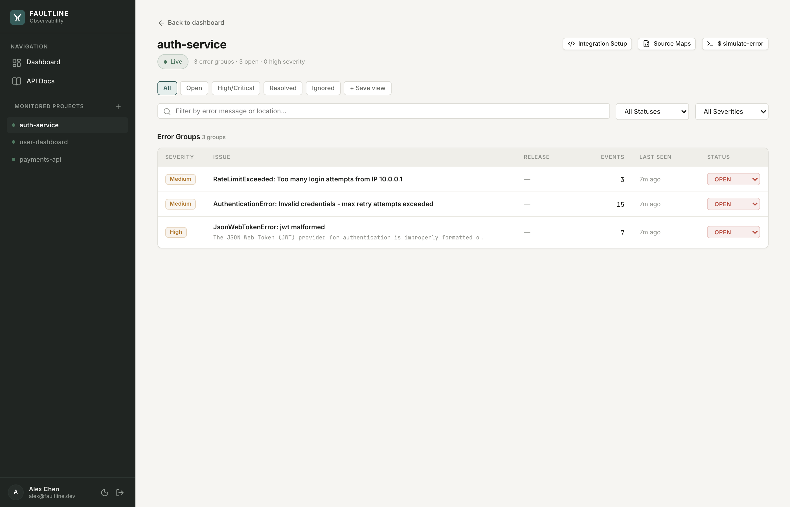

# Faultline: AI-Grounded Error Intelligence Platform

[](#verification-and-test-suite)
[](#tech-stack)
[](#tech-stack)
[](#tech-stack)
[](#license-and-documentation)

> **Faultline** is a modern, developer-first observability platform that captures runtime exceptions, normalizes stack traces with SHA-256 fingerprinting, deduplicates issues into error groups, resolves minified code via Source Maps v3, and delivers asynchronous AI-grounded root-cause diagnosis powered by **Google Gemini 2.5 Flash**.

### Live Demo

**[https://faultline-app.onrender.com](https://faultline-app.onrender.com)**

> Free-tier hosting — the first request may take ~50 seconds while the API cold-starts. Register a new account, create a project, and click **$ simulate-error** to see the full pipeline in action.

---

## Live Workflow Demonstration


*Figure 1: End-to-end telemetry execution path — Error Ingestion & Fingerprinting $\rightarrow$ Group Deduplication $\rightarrow$ Asynchronous Gemini AI Root Cause Analysis $\rightarrow$ Real-Time Server-Sent Events (SSE) Live Stream.*

---

## Key Features

- **Grounded AI Root-Cause Analysis**: Asynchronous background worker uses **Google Gemini 2.5 Flash** combined with GitHub code repository context to diagnose the exact trigger, calculate confidence scores, pinpoint affected functions, and suggest remediation steps.
- **Real-Time Live Telemetry (SSE)**: Server-Sent Events push live error occurrences, count updates, and AI enrichment completions directly to open browser dashboards without polling.
- **Source-Map v3 Stack Trace Resolution**: Synchronous stack re-mapping via `source-map-js` resolves minified production bundle traces (`bundle.min.js:1:2840`) back to original TypeScript/JavaScript source files (`src/services/paymentService.ts:42`).
- **24-Hour Error Frequency & Spike Detection**: Statistical anomaly algorithm compares hourly error velocity against a trailing 24-hour moving baseline to detect and flag sudden incident surges.
- **SHA-256 Stack Fingerprinting & Deduplication**: High-throughput ingestion engine normalizes dynamic values (IDs, hex hashes, memory addresses) and fingerprints frames for atomic error grouping.
- **Interactive Multi-Language SDK Snippets**: Dynamic setup modal and dedicated documentation providing copy-paste integration snippets for **Node.js / Express**, **Python / Flask / FastAPI**, and **cURL**.
- **Interactive API Documentation Portal (`/docs`)**: Built-in, searchable API reference with schema definitions, method badges, interactive code tabs, and architecture flowcharts.
- **Multi-Channel Alerting**: Built-in alerting engine with support for email dispatch via the **Resend API** on new error groups and anomalous volume spikes.
- **Light / Dark Theme Support**: Crafted custom CSS design system with typography, monospace telemetry viewer, and accessible contrast ratios.

---

## System Architecture & Data Flow


```
                      +-------------------+
                      |   Client Apps     |
                      | (Node/Python/curl)|
                      +---------+---------+
                                |
                                | POST /api/events (Bearer flt_...)
                                v
                      +-------------------+
                      |   Express API     |
                      | (Ingestion Engine)|
                      +----+---------+----+
                           |         |
         +-----------------+         +------------------+
         | (Atomic Upsert)                              | (Enqueue Job)
         v                                              v
+------------------+                          +-------------------+
|  MongoDB Atlas   |                          |   Redis & BullMQ  |
| (Groups & Events)|                          | (Queue & Pub/Sub) |
+------------------+                          +---------+---------+
         ^                                              |
         | (State Fetch)                                v
+--------+---------+                          +-------------------+
|  React Dashboard |<======== SSE Stream =====| Background Worker |
| (Vite SPA @ /)   |   (Live Push Updates)    |    (worker.js)    |
+------------------+                          +---------+---------+
                                                        |
                                                        v
                                              +-------------------+
                                              | Google Gemini AI  |
                                              | & GitHub Code VCS |
                                              +-------------------+
```

---

## Platform Screenshots

### 1. Observability Dashboard Overview

*Figure 2: Real-time multi-project overview featuring 24-hour error volume timeline, active spike indicators, unresolved counters, and recent incident triage.*

### 2. Project Error Groups & Filtering

*Figure 3: Dedicated project view with instant search, severity/status filters (All, Open, High/Critical, Resolved, Ignored), release tracking, and test simulation triggers.*

### 3. AI Root-Cause Diagnosis & Source Map Viewer

*Figure 4: Grounded AI root-cause diagnosis card with 94% confidence score, affected file and function detection, interactive remediation checklist, and source-mapped stack trace console.*

### 4. Interactive API Documentation & SDK Setup

*Figure 5: Built-in developer documentation portal with live endpoint search, parameter tables, request/response JSON schemas, and multi-language client snippets.*

---

## Tech Stack

### Frontend (`/client`)
- **Framework**: React 18 + Vite 6
- **Routing**: React Router DOM v6
- **Styling**: Vanilla CSS Design System with light/dark mode CSS tokens, responsive flex/grid layouts, and glassmorphic elevations
- **HTTP Client**: Axios with automatic JWT bearer interceptors and dynamic environment resolution
- **Real-Time Feed**: Browser native `EventSource` (SSE) with ticket-based authentication and auto-reconnect
- **Markdown & Code Display**: `marked` v15 with custom sanitization

### Backend (`/server`)
- **Runtime**: Node.js (v20+)
- **Framework**: Express.js
- **Database**: MongoDB Atlas via Mongoose ORM
- **Queue & Event Pub/Sub**: Redis (local or Render Key Value) with BullMQ
- **AI Intelligence**: `@google/genai` (Google Gemini 2.5 Flash)
- **Source Maps**: `source-map-js` v1.2
- **Email Notifications**: Resend API
- **Security & Protection**: `helmet`, `cors`, `express-rate-limit`, `jsonwebtoken`, `bcryptjs`

---

## REST API Specifications

| Method | Endpoint | Description | Auth Required |
| :--- | :--- | :--- | :--- |
| `POST` | `/api/auth/register` | Register a new user account | Public |
| `POST` | `/api/auth/login` | Authenticate user and receive JWT | Public |
| `GET` | `/api/auth/me` | Fetch authenticated user profile | Bearer JWT |
| `POST` | `/api/events` | Ingest runtime error event | API Key (`flt_...`) |
| `GET` | `/api/projects` | List all monitored projects | Bearer JWT |
| `POST` | `/api/projects` | Create a new project & generate API key | Bearer JWT |
| `GET` | `/api/projects/overview` | Aggregated multi-project dashboard stats | Bearer JWT |
| `GET` | `/api/projects/:id` | Get project metadata & stats | Bearer JWT |
| `PATCH` | `/api/projects/:id` | Update project name or repository | Bearer JWT |
| `DELETE`| `/api/projects/:id` | Delete project and cascade purge events | Bearer JWT |
| `POST` | `/api/projects/:id/simulate` | Ingest simulated test runtime error | Bearer JWT |
| `GET` | `/api/projects/:id/groups` | List paginated error groups with filters | Bearer JWT |
| `GET` | `/api/groups/:id` | Fetch error group detail & AI root cause | Bearer JWT |
| `PATCH` | `/api/groups/:id/status` | Update status (`open`, `resolved`, `ignored`)| Bearer JWT |
| `POST` | `/api/projects/:id/sourcemaps` | Upload a JavaScript `.map` file for a release | Bearer JWT or API Key |
| `GET` | `/api/projects/:id/sourcemaps` | List uploaded source maps | Bearer JWT |
| `DELETE`| `/api/projects/:id/sourcemaps/:mapId` | Delete an uploaded source map | Bearer JWT |
| `GET` | `/api/projects/:id/deployments` | List deployment history & regression correlation | Bearer JWT |
| `POST` | `/api/webhooks/github/:projectId` | Receive a GitHub `deployment_status` webhook | HMAC Signature |
| `GET` | `/api/projects/:id/incidents` | List recent incidents for a project | Bearer JWT |
| `GET` | `/api/incidents/:id` | Fetch incident detail, timeline & AI diagnosis | Bearer JWT |
| `PATCH` | `/api/incidents/:id/status` | Update incident status | Bearer JWT |
| `POST` | `/api/projects/:id/sse-ticket` | Generate a temporary single-use SSE ticket | Bearer JWT |
| `GET` | `/api/sse/stream` | Subscribe to live Server-Sent Events feed | Query Ticket |
| `GET` | `/api/projects/:id/alerts` | Get project email alert configuration | Bearer JWT |
| `PATCH` | `/api/projects/:id/alerts` | Update alert thresholds and recipients | Bearer JWT |
| `GET` | `/api/docs` | Machine-readable API reference (powers `/docs`) | Public |
| `GET` | `/health` | System health check and status | Public |

---

## Quickstart Guide

### Fast path: Docker Compose

The whole stack — Mongo, Redis, API, worker, and the client behind
Nginx — in one command. No local Node/Mongo/Redis install required,
just Docker.

```bash
git clone https://github.com/naba-runn/faultline.git
cd faultline

cp .env.example .env
# edit .env: set JWT_SECRET at minimum; GEMINI_API_KEY/RESEND_API_KEY
# enable AI enrichment / email alerts if provided, the app runs fine
# without them (those features just no-op)

docker compose up --build
```

Open **`http://localhost`** — register, create a project, and either
use the in-app "Simulate Error" button or point `demo-app/` at the
project's API key to send a real ingested error.

This is a separate, local/demo topology from the manual multi-process
setup below and from the Render/Vercel production deploy further down
— see `DECISIONS.md`, "Task 39: two deployment topologies." Prefer
this path for trying the project locally; use the manual steps below
if you want each process running directly under Node (e.g. for
debugging with a local debugger attached).

---

### Manual setup (no Docker)

### Prerequisites
- **Node.js** `>= 20.0.0`
- **npm** `>= 10.0.0`
- **MongoDB Atlas** database URI (or local `mongod`)
- **Redis** instance (local `redis-server` or cloud Redis)
- **Google Gemini API Key** (from Google AI Studio)

---

### 1. Clone & Install Dependencies

```bash
git clone https://github.com/naba-runn/faultline.git
cd faultline

# Install backend dependencies
cd server && npm install

# Install frontend dependencies
cd ../client && npm install
```

---

### 2. Configure Backend Environment

Create `server/.env` with your credentials:

```env
PORT=5050
NODE_ENV=development
MONGODB_URI=mongodb+srv://<user>:<password>@cluster.mongodb.net/faultline
JWT_SECRET=your_super_secret_jwt_key_at_least_32_characters
REDIS_URL=redis://127.0.0.1:6379
GEMINI_API_KEY=your_google_gemini_api_key
RESEND_API_KEY=re_123456789  # (Optional: for email alerts)
CLIENT_ORIGIN=http://localhost:5173
```

---

### 3. Start Local Development Services

```bash
# Terminal 1: Express Ingestion API
cd server
npm run dev

# Terminal 2: Background AI Enrichment Worker
cd server
npm run worker:dev

# Terminal 3: Vite React Frontend
cd client
npm run dev
```

Open **`http://localhost:5173`** in your browser to access the dashboard.

---

## Verification & Test Suite

The backend contains 82 automated unit and integration tests covering deduplication algorithms, spike anomaly detection, source map resolution, and REST contracts:

```bash
cd server
npm test
```

To run the full client production build check:
```bash
cd client
npm run build
```

---

## Production Deployment

The live instance runs on **Render** (free tier):
- **API + Workers**: [faultline-api-fwa5.onrender.com](https://faultline-api-fwa5.onrender.com)
- **Frontend**: [faultline-app.onrender.com](https://faultline-app.onrender.com)
- **Database**: MongoDB Atlas
- **Queue**: Render Redis

### Option A: Decoupled Cloud Deployment (Render / Railway / Vercel)

1. **Express API + Background Workers (Render / Railway / Fly.io)**:
   - Root Directory: `server`
   - Build Command: `npm install`
   - Start Command: `node server.js`
   - The API server embeds all BullMQ workers (enrichment, alerts, deployment-correlation, incident-diagnosis) in a single process — no separate worker service required.
   - Required Environment Variables:
     - `NODE_ENV=production`
     - `MONGODB_URI=mongodb+srv://...`
     - `REDIS_URL=redis://...`
     - `JWT_SECRET=your_secure_secret`
     - `CLIENT_ORIGIN=https://your-dashboard.onrender.com` (supports comma-separated origins)
     - `GEMINI_API_KEY=your_gemini_key`
     - `RESEND_API_KEY=re_...` (optional)

2. **Frontend Dashboard SPA (Render Static Site / Vercel / Netlify)**:
   - Root Directory: `client`
   - Build Command: `npm run build`
   - Output Directory: `dist`
   - Environment Variable: `VITE_API_BASE_URL=https://your-api.onrender.com/api`
   - Includes `client/vercel.json` for client-side SPA routing fallback.

> For high-traffic production use, the worker can be split into a dedicated process (`node worker.js`) with the same environment variables — the architecture supports both topologies.

---

### Option B: Unified Single-Service Deployment (Docker / VPS / Monorepo Container)

When running in production, the Express server automatically serves the prebuilt `client/dist` static assets and handles SPA routing fallback for all non-API web routes.

1. Build both client and server:
   ```bash
   cd client && npm install && npm run build
   cd ../server && npm install
   ```
2. Start the service:
   ```bash
   cd server && node server.js
   ```
3. The platform is accessible at `http://<your-domain>:<PORT>` with zero CORS configuration required.

---

## License & Documentation

- **Interactive API Documentation**: Accessible within the application at `/docs`.
- **Architectural Decision Records**: Available in [`docs/DECISIONS.md`](docs/DECISIONS.md).
- **License**: MIT